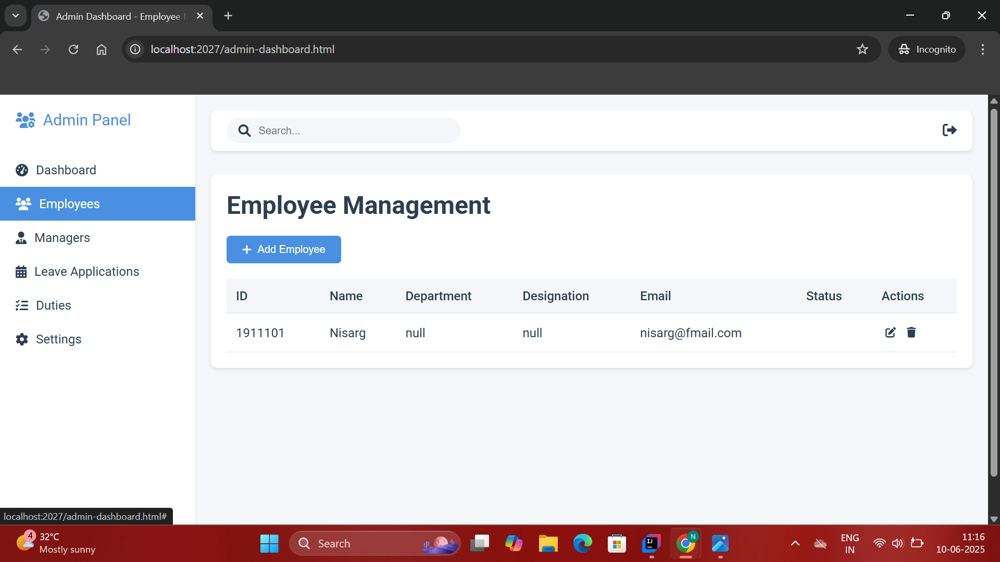

# Employee Management System

## Overview

The Employee Management System is a web-based platform to manage employees, managers, leave applications, and duties. It features secure authentication, role-based access, and a modern, responsive UI for admins, managers, and employees.

---

## Features

- Secure login (JWT authentication)
- Role-based admin, manager, and employee panels
- Employee and manager management
- Leave application workflow
- Duties tracking
- Account settings

---

## Screenshots

> _Place your screenshots in `docs/images/` and use the filenames below._

### Login Page


### Admin Dashboard


### Employee Management


### Manager Management


### Settings Page


---

   mvn spring-boot:run
   ```
   or
   ```bash
   gradle bootRun
   ```

5. **Access the application:**
   - Open your browser and go to `http://localhost:2027/`

---

## Backend Architecture

The backend of the Employee Management System is built using Java Spring Boot and follows a layered architecture:

- **Controllers**: Handle HTTP requests and map them to service layer methods. Each user role (Admin, Manager, Employee) has its own controller.
- **Services**: Contain business logic and interact with repositories. Service interfaces and their implementations ensure modularity.
- **Repositories**: Extend Spring Data JPA repositories for database access. Custom queries are defined using `@Query` annotations.
- **Security**: Uses JWT (JSON Web Token) for stateless authentication. The `JWTUtilizer` class generates and validates tokens. Security configuration is handled via `SecurityConfig`.
- **DTOs**: Data Transfer Objects are used to transfer data between layers and to the frontend.

---

## Admin and Manager Services (Detailed)

### Admin Services

The `AdminService` interface and its implementation (`AdminServiceImplementation`) provide all core business logic for admin-related operations.

#### Interface: `AdminService`

**Main Methods:**
- `Admin checkadminlogin(String identifier, String password)`:  Authenticates an admin using username/email and password.
- `Manager addManager(Manager manager)`:  Adds a new manager, generates credentials, and triggers a welcome email.
- `List<Manager> viewAllManagers()`:  Retrieves all managers.
- `String deleteManager(long mid)`:  Deletes a manager by ID.
- `List<Employee> viewAllEmployees()`:  Retrieves all employees.
- `String deleteEmployee(long eid)`:  Deletes an employee by ID.
- `long managercount()`:  Returns the number of managers.
- `long employeecount()`:  Returns the number of employees.
- `List<Leave> viewAllLeaveApplications()`:  Gets all leave applications for review.

#### Implementation: `AdminServiceImplementation`

**Key Responsibilities:**
- **Authentication:**  Validates admin credentials against the database.
- **Manager Management:**  
  - Generates a unique manager ID and password.
  - Saves the new manager to the database.
  - Sends a welcome email with credentials.
  - Allows deletion of managers.
- **Employee Management:**  
  - Retrieves all employees.
  - Allows deletion of employees.
- **Leave Management:**  
  - Retrieves all leave applications for admin review.
- **Counting:**  
  - Counts total managers and employees.

**Example: Add Manager**
```java
public Manager addManager(Manager manager) {
   Long manager_id = generateRamdomManagerId();
   String randomPassword = generateRandomPassword(8);
   manager.setId(manager_id);
   manager.setPassword(randomPassword);

   Manager savedManager = managerRepository.save(manager);

   // Send welcome email
   Email e = new Email();
   e.setRecipient(manager.getEmail());
   e.setSubject("Welcome Manager");
   e.setMessage("Hi" + manager.getName() + "\nSuccessfully added\nUsername:" + manager.getUsername() + " Password:" + manager.getPassword());
   e.setSentAt(java.time.LocalDateTime.now());
   e.setStatus("PENDING");
   emailRepository.save(e);
   emailService.sendEmail(e.getRecipient(), e.getSubject(), e.getMessage());
   return savedManager;
}
```

---

### Manager Services

The `ManagerService` interface and its implementation (`ManagerServiceImplementation`) provide business logic for manager-related operations.

#### Interface: `ManagerService`

**Main Methods:**
- `Manager checkmanagerlogin(String identifier, String password)`:  Authenticates a manager.
- `Manager findManagerById(long id)`:  Finds a manager by their ID.
- `Manager findManagerByUsername(String username)`:  Finds a manager by username.
- `Manager findManagerByEmail(String email)`:  Finds a manager by email.
- `List<Employee> getTeamMembers(Long managerId)`:  Gets all employees reporting to a manager.
- `List<Duty> viewAssignedDuties(Long managerId)`:  Lists all duties assigned by this manager.
- `void assignDutyToEmployee(Duty duty, Long empId, Long managerId)`:  Assigns a duty to an employee.
- `String generateResetToken(String email)`:  Generates a password reset token for a manager.
- `boolean validateResetToken(String token)`:  Validates a reset token.
- `boolean changePassword(Manager manager, String oldPassword, String newPassword)`:  Changes the manager's password.
- `void updateManager(Manager manager)`:  Updates manager details.

#### Implementation: `ManagerServiceImplementation`

**Key Responsibilities:**
- **Authentication:**  Checks credentials for login.
- **Team Management:**  
  - Retrieves employees reporting to the manager.
  - Assigns duties to employees.
  - Views all duties assigned by the manager.
- **Profile Management:**  
  - Finds manager by ID, username, or email.
  - Updates manager details.
- **Password Management:**  
  - Generates and validates password reset tokens.
  - Changes or updates passwords.

**Example: Assign Duty to Employee**
```java
public void assignDutyToEmployee(Duty duty, Long empId, Long managerId) {
    Employee emp = employeeRepository.findById(empId).orElseThrow();
    Manager manager = managerRepository.findById(managerId).orElseThrow();
    duty.setEmployee(emp);
    duty.setAssignedByManager(manager);
    dutyRepository.save(duty);
}
```

---

## How These Services Interact

- **Controllers** (e.g., AdminController, ManagerController) receive HTTP requests, check authorization, and call the appropriate service methods.
- **Services** handle business logic, validation, and interact with repositories for data access.
- **Repositories** perform CRUD operations on the database.

---

### (See code examples and further details in the next section)

### Main Backend Components

#### 1. Authentication & Security

**JWT Token Utility**

```java
// JWTUtilizer.java
@Service
public class JWTUtilizer {
    private final String SECRET_KEY_STRING = "...";
    private final SecretKey key = Keys.hmacShaKeyFor(SECRET_KEY_STRING.getBytes());

    public String generateJWTToken(String username, String role, Long managerId){
        Map<String, Object> mp = new HashMap<>();
        mp.put("username", username);
        mp.put("role", role);
        if (managerId != null) mp.put("id", managerId);
        return Jwts.builder()
                .setClaims(mp)
                .setSubject(username)
                .setIssuedAt(new Date())
                .setExpiration(new Date(System.currentTimeMillis() + 1000 * 60 * 60 * 2))
                .signWith(key, SignatureAlgorithm.HS256)
                .compact();
    }
    public Map<String, String> validateToken(String token) {
        Map<String, String> res = new HashMap<>();
        try {
            Claims c = Jwts.parserBuilder()
                    .setSigningKey(key)
                    .build()
                    .parseClaimsJws(token)
                    .getBody();
            res.put("username", c.get("username", String.class));
            res.put("role", c.get("role", String.class));
            Object idObj = c.get("id");
            if (idObj != null) {
                res.put("id", String.valueOf(idObj));
            }
            res.put("code", "200");
        } catch (ExpiredJwtException e) {
            res.put("code", "401");
            res.put("error", "token expired:Please login again");
        }
        return res;
    }
}
```

**Security Configuration**

```java
// SecurityConfig.java
@Configuration
public class SecurityConfig {
    @Bean
    public SecurityFilterChain filterChain(HttpSecurity http) throws Exception {
        http
            .csrf(csrf -> csrf.disable())
            .authorizeHttpRequests(auth -> auth
                .anyRequest().permitAll()
            );
        return http.build();
    }
}
```

---

## Controllers (Detailed)

Controllers are responsible for handling HTTP requests, enforcing role-based access, and delegating business logic to the appropriate service classes. Each user role has a dedicated controller:

### AdminController
- **Purpose:** Handles all admin-specific endpoints (managing managers, employees, duties, leave applications, etc.).
- **Key Endpoints:**
    - `POST /admin/addmanager`: Add a new manager (admin-only).
    - `GET /admin/viewallmanagers`: List all managers.
    - `GET /admin/viewallemployees`: List all employees.
    - `DELETE /admin/deleteemployee`: Remove an employee by ID.
    - `DELETE /admin/deletemanager`: Remove a manager by ID.
    - `PUT /admin/assigndutytomanager`: Assign a duty to a manager.
    - `PUT /admin/updateemployeeAccountStatus`: Update an employee's account status.
    - `GET /admin/viewallleaveApplications`: View all leave applications.
    - `GET /admin/managercount`: Get total number of managers.
    - `GET /admin/employeecount`: Get total number of employees.
- **Responsibilities:**
    - Enforces admin role via JWT validation.
    - Converts service results to HTTP responses.
    - Maps request data (JSON, query params) to service calls.

**Example:**
```java
@PostMapping("/addmanager")
public ResponseEntity<String> addManager(@RequestBody Manager manager, @RequestHeader("Authorization") String authHeader) {
    String token = authHeader.substring(7);
    if (!jwtService.validateToken(token).get("role").equals("ADMIN")) {
        return ResponseEntity.status(403).body("Access Denied! Admin privileges required");
    }
    adminService.addManager(manager);
    return ResponseEntity.ok("Manager Added Successfully\nManagerId:" + manager.getId());
}
```

### ManagerController
- **Purpose:** Handles endpoints for manager operations (team management, assigning duties, applying for leave, etc.).
- **Key Endpoints:**
    - `GET /manager/team`: List team members (employees under this manager).
    - `POST /manager/assignduty`: Assign a duty to an employee.
    - `GET /manager/viewassignedduties`: View duties assigned by the manager.
    - `POST /manager/applyleave`: Apply for leave as a manager.
- **Responsibilities:**
    - Enforces manager role via JWT validation.
    - Delegates business logic to ManagerService and related services.
    - Handles input/output mapping for HTTP requests.

### EmployeeController
- **Purpose:** Handles endpoints for employee-specific actions (profile, assigned duties, leave applications, etc.).
- **Key Endpoints:**
    - `GET /employee/profile`: Get employee profile details.
    - `GET /employee/viewduties`: View assigned duties.
    - `POST /employee/applyleave`: Apply for leave as an employee.
    - `DELETE /employee/deleteduty/{id}`: Delete a specific duty.
- **Responsibilities:**
    - Enforces employee role via JWT validation.
    - Delegates business logic to EmployeeService and related services.
    - Handles input/output mapping for HTTP requests.

---

## CRUD Operations in the Backend

This section summarizes the Create, Read, Update, and Delete operations for each main backend entity, including example endpoints and service methods.

### Employee CRUD Operations
- **Create:**
    - Endpoint: `POST /admin/addemployee`
    - Service: `adminService.addEmployee(Employee employee)`
    - Example:
    ```java
    public Employee addEmployee(Employee employee) {
        // Generate ID, set defaults, save to repository
        return employeeRepository.save(employee);
    }
    ```
- **Read:**
    - Endpoint: `GET /admin/viewallemployees`
    - Service: `adminService.viewAllEmployees()`
    - Example:
    ```java
    public List<Employee> viewAllEmployees() {
        return employeeRepository.findAll();
    }
    ```
- **Update:**
    - Endpoint: `PUT /admin/updateemployee`
    - Service: `adminService.updateEmployee(Employee employee)`
    - Example:
    ```java
    public Employee updateEmployee(Employee employee) {
        return employeeRepository.save(employee);
    }
    ```
- **Delete:**
    - Endpoint: `DELETE /admin/deleteemployee/{id}`
    - Service: `adminService.deleteEmployee(long eid)`
    - Example:
    ```java
    public String deleteEmployee(long eid) {
        employeeRepository.deleteById(eid);
        return "Employee deleted";
    }
    ```

### Manager CRUD Operations
- **Create:**
    - Endpoint: `POST /admin/addmanager`
    - Service: `adminService.addManager(Manager manager)`
- **Read:**
    - Endpoint: `GET /admin/viewallmanagers`
    - Service: `adminService.viewAllManagers()`
- **Update:**
    - Endpoint: `PUT /admin/updatemanager`
    - Service: `managerService.updateManager(Manager manager)`
    - Example:
    ```java
    public void updateManager(Manager manager) {
        managerRepository.save(manager);
    }
    ```
- **Delete:**
    - Endpoint: `DELETE /admin/deletemanager/{id}`
    - Service: `adminService.deleteManager(long mid)`
    - Example:
    ```java
    public String deleteManager(long mid) {
        managerRepository.deleteById(mid);
        return "Manager deleted";
    }
    ```

### Duty CRUD Operations
- **Create:**
    - Endpoint: `POST /manager/assignduty`
    - Service: `managerService.assignDutyToEmployee(Duty duty, Long empId, Long managerId)`
- **Read:**
    - Endpoint: `GET /manager/viewassignedduties`
    - Service: `managerService.viewAssignedDuties(Long managerId)`
- **Update:**
    - Endpoint: `PUT /manager/updateduty`
    - Service: `dutyService.updateDuty(Duty duty)`
    - Example:
    ```java
    public Duty updateDuty(Duty duty) {
        return dutyRepository.save(duty);
    }
    ```
- **Delete:**
    - Endpoint: `DELETE /employee/deleteduty/{id}`
    - Service: `dutyService.deleteDuty(Long dutyId)`
    - Example:
    ```java
    public void deleteDuty(Long dutyId) {
        dutyRepository.deleteById(dutyId);
    }
    ```

### Leave CRUD Operations
- **Create:**
    - Endpoint: `POST /employee/applyleave`, `POST /manager/applyleave`
    - Service: `leaveService.applyLeave(Leave leave)`
- **Read:**
    - Endpoint: `GET /admin/viewallleaveApplications`, `GET /manager/viewleaveApplications`, `GET /employee/viewleaveApplications`
    - Service: `leaveService.viewAllLeaveApplications()`
- **Update:**
    - Endpoint: `PUT /admin/updateleaveStatus`
    - Service: `leaveService.updateLeaveStatus(Long leaveId, String status)`
    - Example:
    ```java
    public Leave updateLeaveStatus(Long leaveId, String status) {
        Leave leave = leaveRepository.findById(leaveId).orElseThrow();
        leave.setStatus(status);
        return leaveRepository.save(leave);
    }
    ```
- **Delete:**
    - (Usually not deleted, but could be implemented as needed)

---

#### 3. Services

**AdminServiceImplementation** (Business logic for admin operations)

```java
// AdminServiceImplementation.java
@Service
public class AdminServiceImplementation implements AdminService {
    @Autowired private AdminRepository adminRepository;
    @Autowired private ManagerRepository managerRepository;
    @Autowired private EmailService emailService;
    @Autowired private EmailRepository emailRepository;
    @Autowired private EmployeeRepository employeeRepository;
    @Autowired private LeaveRepository leaveRepository;

    @Override
    public Manager addManager(Manager manager) {
       Long manager_id = generateRamdomManagerId();
       String randomPassword = generateRandomPassword(8);
       manager.setId(manager_id);
       manager.setPassword(randomPassword);
       Manager savedManager = managerRepository.save(manager);
       // Send welcome email
       Email e = new Email();
       e.setRecipient(manager.getEmail());
       e.setSubject("Welcome Manager");
       e.setMessage("Hi" + manager.getName() + "\nSuccessfully added\nUsername:" + manager.getUsername() +" Password:" + manager.getPassword());
       e.setSentAt(java.time.LocalDateTime.now());
       e.setStatus("PENDING");
       emailRepository.save(e);
       emailService.sendEmail(e.getRecipient(),e.getSubject(),e.getMessage());
       return savedManager;
    }
    // ... other business logic (deleteManager, viewAllEmployees, etc.)
}
```

#### 4. Repositories

**AdminRepository** (Spring Data JPA Repository)

```java
// AdminRepository.java
@Repository
public interface AdminRepository extends JpaRepository<Admin, Integer> {
    @Query("SELECT a FROM Admin a WHERE (a.username = :identifier OR a.email = :identifier) AND a.password = :password")
    Admin findByUsernameOrEmailAndPassword(@Param("identifier") String identifier, @Param("password") String password);
    // ... other queries
}
```

**EmployeeRepository**, **ManagerRepository**, **DutyRepository**, etc., follow similar patterns for their respective entities.

#### 5. Example: Adding a Manager (End-to-End)

- **Controller:** Receives HTTP POST `/admin/addmanager` and validates admin role.
- **Service:** Generates manager ID/password, saves manager, sends welcome email.
- **Repository:** Persists manager entity to the database.

---

## Feature-Based Code Snippets

### 1. User Authentication (JWT Login)

**Frontend:**

```html
<!-- login.html -->
<form id="loginForm">
    <input type="text" name="username" placeholder="Username" required />
    <input type="password" name="password" placeholder="Password" required />
    <button type="submit">Login</button>
</form>
<script>
document.getElementById('loginForm').addEventListener('submit', async function(e) {
    e.preventDefault();
    const formData = new FormData(this);
    const response = await fetch('/api/auth/login', {
        method: 'POST',
        body: JSON.stringify({
            username: formData.get('username'),
            password: formData.get('password')
        }),
        headers: { 'Content-Type': 'application/json' }
    });
    const data = await response.json();
    if (data.token) {
        localStorage.setItem('jwt', data.token);
        // Redirect or update UI
    }
});
</script>
```

---

### 2. Role-Based Access

**Backend:**

```java
// ManagerService.java
@PreAuthorize("hasRole('MANAGER')")
public List<Employee> getTeamMembers(Long managerId) { /* ... */ }
```

**Frontend:**

```javascript
// manager.js
const userRole = localStorage.getItem('role');
if (userRole === 'ADMIN') {
    document.getElementById('adminPanel').style.display = 'block';
} else {
    document.getElementById('adminPanel').style.display = 'none';
}
```

---

### 3. Employee CRUD Operations

**Backend:**

```java
// EmployeeService.java
public Employee saveEmployee(Employee employee) {
    return employeeRepository.save(employee);
}
```

**Frontend:**

```javascript
// manager.js
fetch('/api/employees', {
    headers: { 'Authorization': 'Bearer ' + localStorage.getItem('jwt') }
})
.then(response => response.json())
.then(data => {
    const table = document.getElementById('employeeTable');
    data.forEach(emp => {
        const row = document.createElement('tr');
        row.innerHTML = `<td>${emp.name}</td><td>${emp.role}</td>`;
        table.appendChild(row);
    });
});
```

```html
<!-- employees.html -->
<table id="employeeTable">
    <tr>
        <th>Name</th>
        <th>Role</th>
    </tr>
    <!-- Rows will be populated by JS -->
</table>
```

---

### 4. Manager Dashboard

**Backend:**

```java
// ManagerService.java
public List<Employee> getTeamMembers(Long managerId) { /* ... */ }
```

**Frontend:**

```javascript
// manager.js
function loadTeam() {
    fetch('/api/manager/team', {
        headers: { 'Authorization': 'Bearer ' + localStorage.getItem('jwt') }
    })
    .then(res => res.json())
    .then(team => {
        // Render team members in dashboard
    });
}
```

---

### 5. Admin Controls

**Backend:**

```java
// AdminService.java
public void assignRoleToUser(Long userId, String role) { /* ... */ }
```

**Frontend:**

```html
<select id="userRoleSelect">
    <option value="EMPLOYEE">Employee</option>
    <option value="MANAGER">Manager</option>
    <option value="ADMIN">Admin</option>
</select>
<button onclick="assignRole()">Assign Role</button>
<script>
function assignRole() {
    const userId = ...; // get from UI
    const role = document.getElementById('userRoleSelect').value;
    fetch(`/api/admin/assign-role`, {
        method: 'POST',
        headers: {
            'Content-Type': 'application/json',
            'Authorization': 'Bearer ' + localStorage.getItem('jwt')
        },
        body: JSON.stringify({ userId, role })
    });
}
</script>
```

---

### 6. Settings Page

```html
<!-- settings section -->
<form id="settingsForm">
    <input type="text" name="username" />
    <input type="email" name="email" />
    <input type="password" name="currentPassword" />
    <input type="password" name="newPassword" />
    <button type="submit">Update Settings</button>
</form>
```

---

## Contribution Guidelines

1. Fork the repository
2. Create a new branch (`git checkout -b feature/your-feature`)
3. Commit your changes
4. Push to the branch (`git push origin feature/your-feature`)
5. Create a pull request
